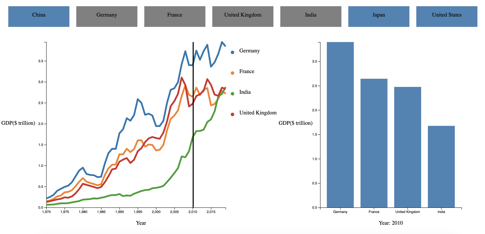

## Group member: Yang Di & Zixuan Zhao

# Plans

We want to visualize the GDP of several countries over years.

The graph will contain three parts.

### Button-like selector

The user can choose which country(-ies) they want to visualize by clicking on the buttons. And they can remove countries simply by clicking on them again.

### Line Chart

This graph will show the GDP of the selected countries over years. The x-axis is the years, y-axis is the GDP. Data from different countries will be distinguished by colors of the lines.

When the user move the mouse, there will be a vertical line attached to the mouse (which tells the year the mouse is at). And when the user clicks when the mouse is at a certain year, a bar chart will show up.

### Bar Chart

This graph will show the GDP of the selected countries at a particular year (the year is chosen by clicking on the line chart).

# How to use

First clone the repository: 

    git clone https://github.com/RobbieZhao/CS6017_Homework7.git
    
Change the directory:

    cd CS6017_Homework7
    
Open up a local server:

    python3 -m http.server 8080

Then open a browser, and visit:
    
    localhost:8080
    
# What it's like

    
    
    
    
    
    
    
    
    
    
    
    
    